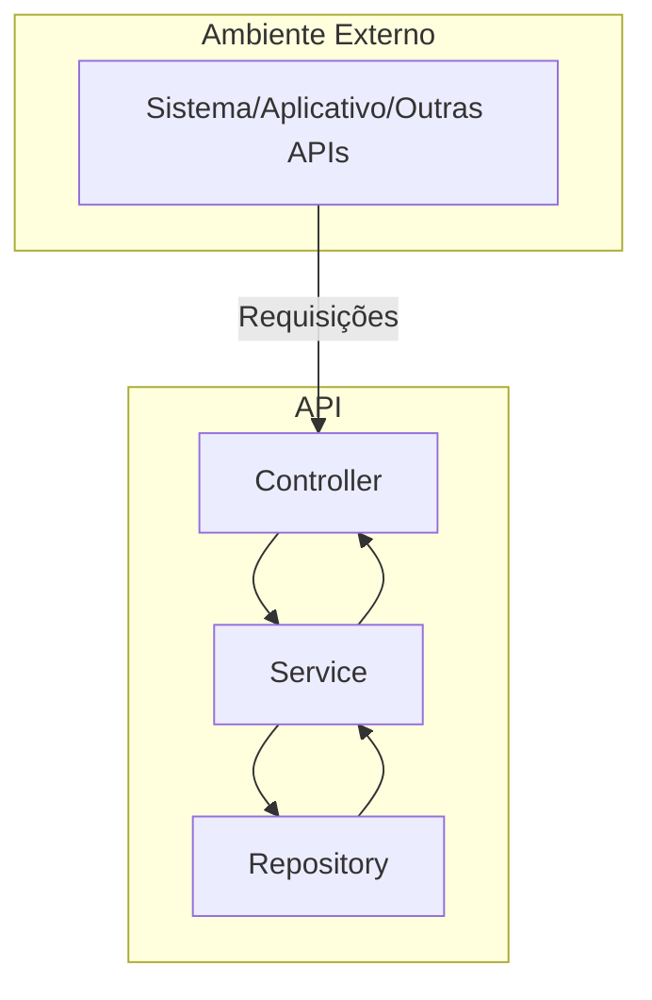

# api-money-transfer
API for bank transfer schedules

## Objetivo

Realizar o cálculo da taxa de acordo com o valor de transfrência/data de agendamento.

## Frameworks
Foi utilizado o Spring Boot para criação da API e adicionado alguns Starters e suas finalidades básicas:
 - Spring Web: responsável pela criação das APIs;
 - Spring Boot DevTools: Ajuda no hotdeploy da aplicação;
 - Maven: Gerenciamento de dependências e build;
 - Junit: Testes unitários;
 - Spring Data JPA: Manipulação do banco de dados utilizando o JPA;
 - H2: Banco em memória;

## Arquitetura



## Instalação
Para realizar a instalação, faça o clone do projeto em uma pasta local de sua preferência:

```git clone https://github.com/rogeriomaia1/api-money-transfer.git``` <br/><br/>
Sugiro usar o **Spring Tools** disponível para download gratuito, como IDE para desenvolvimento. Na IDE, importe o projeto Maven para iniciar a codificação.


## Realizar Agendamento
A chamada do endpoint **_https://rmaia-transfer-api.herokuapp.com/transfer/insert deve-se utilizar o payload abaixo como exemplo(todos os campos são obrigatórios):
```json
{
    "sourceAccount": "" ,
    "destinationAccount": "" ,
    "transferValue": "",
    "transferDate": ""  
}
```
<ul>
  <li>sourceAccount: Informar a conta de origem.</li>
  <li>destinationAccount: Informar a conta de destino.</li>
  <li>transferValue: Informar o valor a ser transferido</li>
  <li>transferDate: informar a data em que deve ocorrer a transferência.</li>
</ul>

 Como resposta a API deve devolver o valor da taxa a ser aplicada à transferência e a data do processamento do agendamento.
 
 ## Consultar Agendamentos
 
Para listar os agendamentos deve-se realizar a chamada ao endpoint:
```https://rmaia-transfer-api.herokuapp.com/transfer/list``` 


